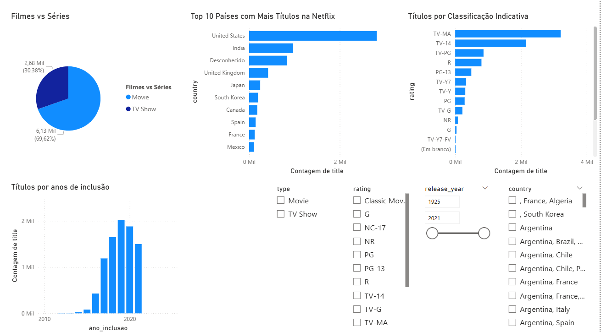

# Dashboard Interativo da Netflix com Power BI

Este projeto apresenta uma análise visual interativa de dados da Netflix, desenvolvido com **Power BI** e publicado em uma página web com HTML e CSS.



## Objetivo
O objetivo é permitir a exploração do catálogo da Netflix por meio de filtros dinâmicos, revelando padrões como:
- Volume de títulos por tipo, ano, país e classificação indicativa;
- Sazonalidade na inclusão de conteúdos;
- Origem geográfica predominante;

## Principais Insights
- **Distribuição de Conteúdo:** Filmes representam cerca de 70% do catálogo.
- **Origem:** EUA são o principal país produtor dos títulos.
- **Período de Inclusão:** Picos de adição entre 2017 e 2020.
- **Classificação Indicativa:** TV-MA é a mais comum.
- **Filtros:** Por tipo, país, ano e rating.

## Download
Baixe o arquivo `.pbix` para explorar o dashboard diretamente no Power BI Desktop:

> [⬇️ Netflix_Analise_Dashboard.pbix](Netflix_Analise_Dashboard.pbix)

## Estrutura do Projeto
```
├── index.html                      # Estrutura da página
├── style.css                       # Estilo visual
├── Netflix_Analise_Dashboard.pbix  # Arquivo do Power BI
├── image.png                       # Imagem de visualização do dashboard
├── README.md                       # Este arquivo
```

## Tecnologias Utilizadas
- **Power BI Desktop**
- **HTML5 / CSS3**
- **GitHub Pages** para publicação

## Autora
**Maria Eduarda de Oliveira**  
[LinkedIn](https://www.linkedin.com/in/maria-eduarda-oliveira-sant/)  |  [GitHub](https://github.com/olivmadu)

---

> Este é um projeto de estudo e apresenta dados para fins de exploração e aprendizado com ferramentas de visualização de dados.
